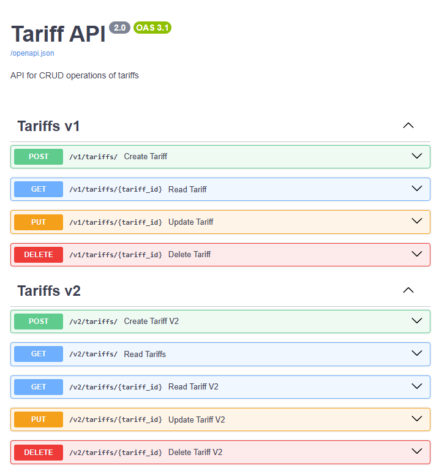
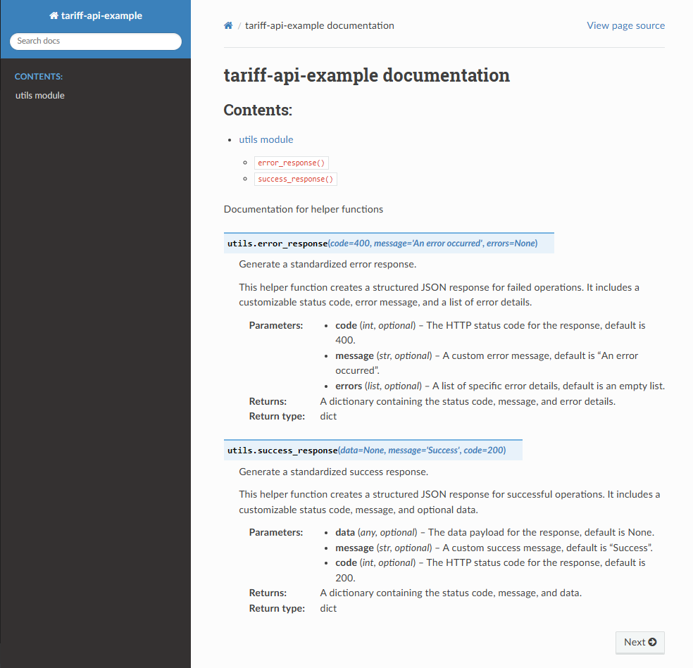
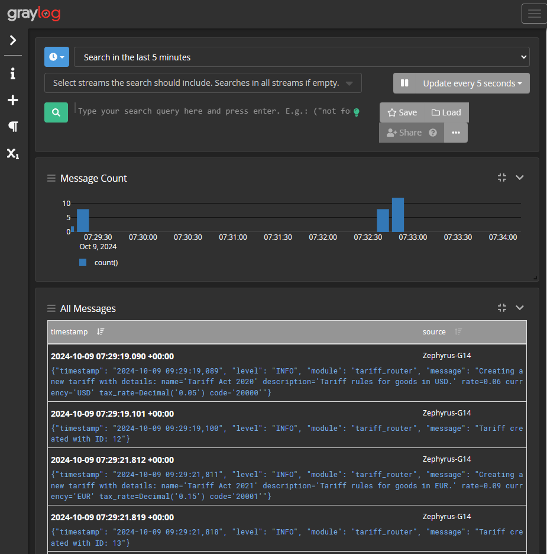

# FastAPI Backend Server

## Overview

This project is a FastAPI backend server designed for efficient resource management through versioned APIs. FastAPI was chosen for its simplicity and speed, offering an easier setup compared to Django, while also providing more advanced features than Flask. This makes it a great fit for modern web applications that require performance without unnecessary complexity.

The use of pytest for testing ensures that the codebase remains reliable and maintainable, allowing for quick identification and resolution of issues.

The server includes API documentation via Swagger, enabling  exploration of the available endpoints. Additionally, Sphinx is employed to generate documentation from the code's docstrings, which aids in understanding the functionality. Lastly, Greylog is implemented for centralized log management, providing insights into application behavior and facilitating efficient monitoring and troubleshooting.

## Features

- FastAPI framework
- SQLAlchemy integration for database management
- Versioned APIs (v1 and v2)
- CRUD operations
- Test cases using pytest
- API documentation with Swagger
- Code documentation using Sphinx
- Log management with Greylog


## Getting Started

### Cloning the Repository (Stand-Alone Fast API app)

To get a copy of the project up and running on your local machine, follow these steps:

**Clone the Repository**

```bash
git clone https://github.com/shounak77/fast-api-backend
cd fast-api-backend
```
**Create a Virtual Environment**
```
python -m venv .venv
```
**Activate the Virtual Environment**

On Windows:
```
.venv\Scripts\activate
```
On Linux/macOS:
```
source .venv/bin/activate
```
**Install Requirements**
```
pip install -r requirements.txt
```
**Run the Application**
```
uvicorn main:app --reload
```

**Access API Documentation**
Once the application is running, navigate to http://localhost:8000/docs in your web browser to view the API documentation.

### Run with Docker Compose

Alternatively one can run the application using Docker Compose. 
- Ensure you have docker installed. 

- Download just the [docker-compose.yml](docker-compose.yml) file.
- Ensure to update the crediantial details for graylog in `docker-compose.yml`.

```
environment:
  - GRAYLOG_PASSWORD_SECRET=YourSecretPass  
  - GRAYLOG_ROOT_PASSWORD_SHA2=YourPasswordHash
```

**Start the Application**
```
docker-compose up -d
```
**Accessing the Application and Logs**

Once the application is running, you can access the FastAPI documentation at http://localhost:8000/docs in your web browser.

Graylog interface can be accessed by navigating to http://localhost:9000 in your web browser. Root username is `admin`

---

## Application Documentation

Below each feature in the application is explained in slightly more detail

## Swagger API Docs

Below is a screenshot of the API documentation generated by Swagger, which is available at the `/docs` endpoint of the running application:




## Sphinx Documentation

Sphinx generates documentation based on the docstrings in the code and supports various output formats, making it easy to maintain comprehensive project documentation. Below is a screenshot of the documentation for the functions in `utils.py`:



## Graylog for Log Management

Graylog provides centralized log management, allowing for efficient monitoring and analysis of application logs. Graylog is chosen for log management over alternatives like ELK due to its user-friendly interface and simplified setup process. Below is a screenshot of the Greylog interface displaying application logs:




## API Endpoints

### Version 1 (v1)

- **POST /v1/tariffs**: Create a new tariff
- **GET /v1/tariffs/{id}**: Retrieve a specific tariff by ID
- **PUT /v1/tariffs/{id}**: Update an existing tariff by ID
- **DELETE /v1/tariffs/{id}**: Delete a tariff by ID

### Version 2 (v2)

- **POST /v2/tariffs**: Create a new tariff
- **GET /v2/tariffs?QueryParmas**: Retrieve a list of tariffs which match the query
- **GET /v2/tariffs/{id}**: Retrieve a specific tariff by ID
- **PUT /v2/tariffs/{id}**: Update an existing tariff by ID
- **DELETE /v2/tariffs/{id}**: Delete a tariff by ID

Version 2 introduces standard API responses for both success and error scenarios:

- **Success Response**: Standardized structure with a message and the returned data.
- **Error Response**: Consistent error format with a message and error details (e.g., status code, error type).


### Examples (v1)

#### Create a Tariff (POST /v1/tariffs/)


```
curl -X 'POST'
'http://127.0.0.1:8000/v1/tariffs/'
-H 'accept: application/json'
-H 'Content-Type: application/json'
-d '{ "name": "Trade Act of 2002", "description": "U.S. Trade Act of 2002 specifying the allowed goods and applicable tax rates.", "rate": 0.02, "currency": "USD", "tax_rate": 0.12, "code": "US002" }'
```

**Response:**
```json
{
  "name": "Trade Act of 2002",
  "description": "U.S. Trade Act of 2002 specifying the allowed goods and applicable tax rates.",
  "rate": 0.02,
  "currency": "USD",
  "tax_rate": "0.1200000000",
  "code": "US002",
  "id": 2
}
```


### Examples v2 Tariff API.

- Uses a standard response template for consistency.
- Allows filtering tariffs by specific parameters.

#### Create a Tariff (POST /v2/tariffs/)
```
curl -X 'POST'
  'http://127.0.0.1:8000/v2/tariffs/'
  -H 'accept: application/json'
  -H 'Content-Type: application/json'
  -d '{
  "name": "Export Duty Act 2024",
  "description": "Regulation defining export tariffs and specifying the applicable tax rates for various categories of goods.",
  "rate": 0.05,
  "currency": "EUR",
  "tax_rate": 0.15,
  "code": "EU024"
}'

```
**Response:**

```
{
  "code": 200,
  "message": "Tariff created successfully",
  "data": {
    "rate": 0.05,
    "name": "Export Duty Act 2024",
    "id": 3,
    "currency": "EUR",
    "tax_rate": 0.15,
    "description": "Regulation defining export tariffs and specifying the applicable tax rates for various categories of goods.",
    "code": "EU024"
  }
}

```